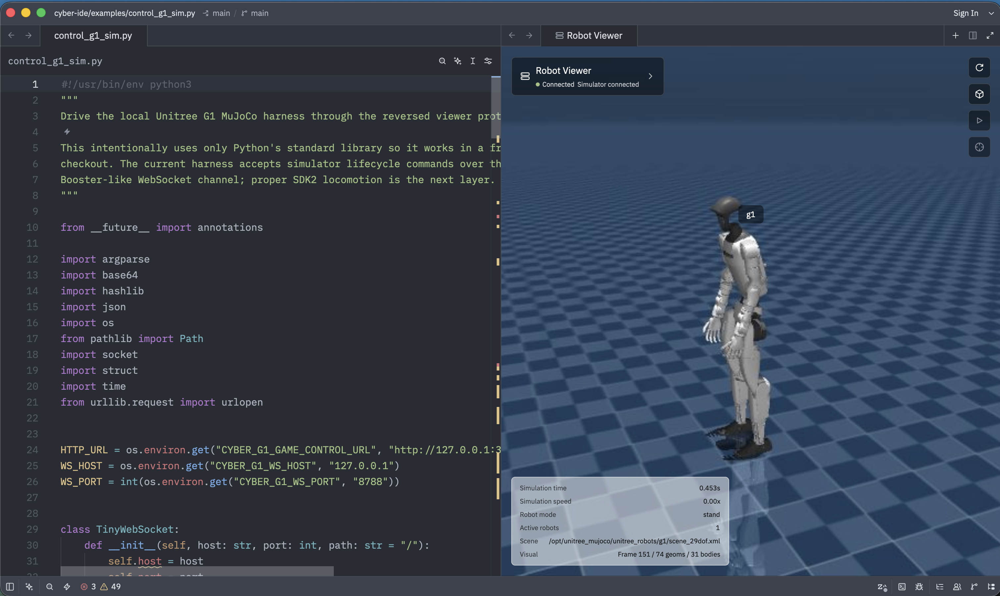

# Cybernetic IDE

Cybernetic IDE is a robotics development environment built from a Zed code
editor foundation and extended with an embedded MuJoCo robot viewer, Dockerized
simulation runtime, and Unitree G1 SDK-shaped control path.

The current milestone is focused on making simulated robotics feel like normal
software development: write Python code on one side, inspect the G1 MuJoCo
scene on the other, and send Unitree-style SDK calls into the simulator without
making the user think about the transport layer.



## What Cybernetic IDE Adds

- Embedded **Robot Viewer** workspace item for the Unitree G1 MuJoCo scene.
- Dockerized G1 MuJoCo protocol harness under
  `overlays/unitree-g1-mujoco-*`.
- Booster Studio-inspired simulator wire shape: physics WebSocket on `8788`,
  GameControl-style HTTP on `38383`, MessagePack visual frames, cached camera
  frames, and lifecycle commands.
- Interactive viewer camera controls for orbit, pan, zoom, reset, pause,
  resume, step, and refresh.
- A Unitree SDK2-shaped Python facade under
  `overlays/unitree-g1-sdk-shim/` so end-user code can call
  `G1ArmActionClient.ExecuteAction(action_map["right hand up"])`.
- An installable `cybernetic-robotics` Python package under
  `packages/cybernetic-robotics/` with a beginner `G1Robot` API, CLI, raw
  protocol clients, scene helpers, and a packaged `unitree_sdk2py` simulator
  shim, including the Unitree-shaped `G1ArmActionClient`, `LocoClient`,
  `rt/lowcmd`, and `rt/lowstate` surfaces.
- Example scripts in `examples/` for both low-level simulator probes and the
  Unitree-shaped hand-raise demo.
- Cybernetic IDE task entries for running the simulator demo directly from the
  IDE.

## Repository Map

| Path | Purpose |
| --- | --- |
| `crates/cyber_robot_viewer/` | Cybernetic IDE workspace item that embeds the Robot Viewer and manages the local Docker/MuJoCo harness. |
| `overlays/unitree-g1-mujoco-protocol/` | Python MuJoCo renderer/control server packaged as `cyber/unitree-g1-mujoco-protocol:0.1.0`. |
| `overlays/unitree-g1-mujoco-container/` | Docker Compose wrapper that mounts the Unitree G1 MuJoCo assets and exposes `8788`/`38383`. |
| `overlays/unitree-g1-sdk2-sidecar/` | Opt-in diagnostic sidecar scaffold for pinned official `unitree_sdk2_python`, `unitree_sdk2`, and `unitree_mujoco` sources. |
| `overlays/unitree-g1-sdk-shim/` | Bootstrap `unitree_sdk2py` compatibility package for simulator-backed Unitree-shaped code. |
| `packages/cybernetic-robotics/` | Installable Python package for beginner-friendly G1 control, power-user protocol access, MJCF scene helpers, and Unitree SDK2-shaped imports. |
| `packages/g1-yoga-rl/` | LocoMuJoCo research utilities for projecting Cybernetic G1 yoga poses into training trajectories. |
| `script/prepare-unitree-g1-mujoco-container.mjs` | Fetches the pinned public `unitreerobotics/unitree_mujoco` G1 assets into `.runtime/` and writes `compose.env`. |
| `script/prepare-unitree-g1-sdk2-sidecar.mjs` | Fetches pinned official Unitree SDK2 Python/C++ and MuJoCo sources into `.runtime/` for sidecar diagnostics. |
| `script/probe-unitree-g1-mujoco-protocol.mjs` | CLI probe for the reversed Booster-like simulator envelope. |
| `examples/control_g1_sim.py` | Dependency-free Python control/probe script for reset, step, camera, and pose commands. |
| `examples/g1_raise_hand_sdk.py` | End-user-style Unitree SDK2 facade demo that raises the G1's right hand. |
| `examples/g1_loco_sdk.py` | End-user-style Unitree G1 `LocoClient` demo for start, move, stop, and wave-hand commands. |
| `examples/g1_lowcmd_sdk.py` | Low-level Unitree SDK2-shaped `rt/lowcmd` / `rt/lowstate` demo for conservative arm joint control. |
| `examples/g1_joint_targets.py` | Named-joint control demo that compiles joint names to simulator-backed lowcmd slots. |
| `examples/g1_behavior_gallery.py` | Behavior gallery that runs arm action, locomotion, wave, stand-height, safe-neutral, and saves snapshots. |
| `examples/easy_g1_playground.py` | Beginner package demo using `cybernetic_robotics.G1Robot`. |
| `examples/use_cybernetic_robotics_lib.py` | Polished package demo that exercises both `G1Robot` and the Unitree SDK2-shaped shim. |
| `docs/src/unitree-g1-sdk-integration.md` | Architecture, end-user guide, developer guide, safety gates, and next milestones. |
| `docs/src/cybernetic-robotics-python.md` | User and developer guide for the installable Python robotics package. |

## Quick Start

Prerequisites:

- macOS or Linux with Docker available.
- `node`, `python3`, `cargo`, and `git`.
- Enough disk space for the pinned public Unitree MuJoCo assets under
  `.runtime/unitree-g1-mujoco/`.

Build the Cybernetic IDE binary:

```sh
cargo build -p zed
```

Prepare the Unitree G1 MuJoCo assets and compose environment:

```sh
node script/prepare-unitree-g1-mujoco-container.mjs
```

Build the local MuJoCo protocol image:

```sh
docker build -t cyber/unitree-g1-mujoco-protocol:0.1.0 overlays/unitree-g1-mujoco-protocol
```

Start the simulator container:

```sh
docker compose \
  --env-file .runtime/unitree-g1-mujoco/compose.env \
  -f overlays/unitree-g1-mujoco-container/compose.yaml \
  up -d
```

Prepare the optional official SDK2 sidecar sources and run its diagnostic
report:

```sh
node script/prepare-unitree-g1-sdk2-sidecar.mjs
docker compose \
  --env-file .runtime/unitree-g1-sdk2/compose.env \
  -f overlays/unitree-g1-sdk2-sidecar/compose.yaml \
  run --rm unitree-g1-sdk2-sidecar
```

Launch Cybernetic IDE on the example:

```sh
./target/debug/zed examples/control_g1_sim.py
```

Open the Command Palette and run:

```text
cyber: open robot viewer beside
```

The Robot Viewer should open beside the active code pane and connect to the
local simulator.

Install the Python package for the easiest control path:

```sh
python3 -m pip install -e packages/cybernetic-robotics
```

Then try:

```sh
cyber-g1 status
cyber-g1 raise-hand --snapshot .runtime/g1-control-demo/right-hand-up.jpg
python3 examples/use_cybernetic_robotics_lib.py
python3 examples/g1_loco_sdk.py
python3 examples/g1_lowcmd_sdk.py
python3 examples/g1_joint_targets.py
python3 examples/g1_behavior_gallery.py
python3 examples/easy_g1_playground.py
```

Or write a small script:

```python
from cybernetic_robotics import G1Robot

with G1Robot.connect() as robot:
    robot.raise_right_hand()
    robot.snapshot(".runtime/g1-control-demo/right-hand-up.jpg")
```

## Running the Hand-Raise Demo

The SDK-shaped demo intentionally looks like a Unitree SDK2 Python example:

```python
from unitree_sdk2py.core.channel import ChannelFactoryInitialize
from unitree_sdk2py.g1.arm.g1_arm_action_client import G1ArmActionClient, action_map

ChannelFactoryInitialize(0, "cyber-sim")

arm = G1ArmActionClient()
arm.SetTimeout(10.0)
arm.Init()
arm.ExecuteAction(action_map["right hand up"])
arm.ExecuteAction(action_map["high five"])
```

The local simulator maps Unitree's preset G1 arm actions to deterministic
static poses, including `right hand up`, `high five`, `hands up`, `clap`,
`hug`, `heart`, `face wave`, `high wave`, `shake hand`, and release.

Run it from the terminal:

```sh
python3 examples/g1_raise_hand_sdk.py
```

After installing `packages/cybernetic-robotics`, the same import shape is
available without manually injecting `overlays/unitree-g1-sdk-shim` onto
`PYTHONPATH`.

For lower-level SDK2-shaped control, use the channel APIs:

```python
from unitree_sdk2py.core.channel import ChannelFactoryInitialize, ChannelPublisher, ChannelSubscriber
from unitree_sdk2py.idl.default import unitree_hg_msg_dds__LowCmd_
from unitree_sdk2py.idl.unitree_hg.msg.dds_ import LowCmd_, LowState_

ChannelFactoryInitialize(0, "cyber-sim")

lowstate_sub = ChannelSubscriber("rt/lowstate", LowState_)
lowstate_sub.Init()
low_state = lowstate_sub.Read()

low_cmd = unitree_hg_msg_dds__LowCmd_()
low_cmd.motor_cmd[22].mode = 1
low_cmd.motor_cmd[22].q = -1.0
low_cmd.motor_cmd[22].kp = 30.0
low_cmd.motor_cmd[22].kd = 1.0

lowcmd_pub = ChannelPublisher("rt/lowcmd", LowCmd_)
lowcmd_pub.Init()
lowcmd_pub.Write(low_cmd)
```

The complete runnable version is:

```sh
python3 examples/g1_lowcmd_sdk.py
```

Or run the task inside Cybernetic IDE:

```text
raise Unitree G1 hand via Unitree SDK facade
```

The current bootstrap backend maps that Unitree-shaped call to the local
Dockerized MuJoCo command:

```json
{ "command": "pose", "pose": "raise_right_hand" }
```

That direct pose command is intentionally transitional. The user-facing API is
already aligned with Unitree SDK2; the backend can move toward official
`unitree_mujoco` + SDK2/CycloneDDS topics without changing example code.

## Running the G1 LocoClient Demo

Unitree's official Python SDK exposes high-level G1 locomotion through
`unitree_sdk2py.g1.loco.g1_loco_client.LocoClient`. Cybernetic's simulator
shim now supports that import shape for local development:

```python
from unitree_sdk2py.core.channel import ChannelFactoryInitialize
from unitree_sdk2py.g1.loco.g1_loco_client import LocoClient

ChannelFactoryInitialize(0, "cyber-sim")

loco = LocoClient()
loco.SetTimeout(10.0)
loco.Init()
loco.Start()
print(loco.GetFsmId())
print(loco.GetFsmMode())
loco.SetSwingHeight(0.08)
print(loco.GetSwingHeight())
loco.Move(0.25, 0.0, 0.0)
loco.StopMove()
```

Run the included example:

```sh
python3 examples/g1_loco_sdk.py
```

The current backend maps `Move` to a simple simulator-base velocity and maps
FSM/stand/arm-task commands to local simulator state and poses. Full
CycloneDDS `LowCmd`/`LowState` parity remains the deeper sim-to-real backend.

## Robot Viewer Controls

The embedded viewer polls the simulator over HTTP and renders cached JPEG
camera frames from MuJoCo. Mouse input is sent as lightweight camera commands
so viewport interaction is not blocked by a fresh render.

| Control | Behavior |
| --- | --- |
| Drag | Orbit the MuJoCo free camera. |
| Scroll | Zoom the camera. |
| Refresh button | Reconnect/reprobe the simulator. |
| Cube button | Reset the MuJoCo camera framing. |
| Play/Pause button | Resume or pause simulation stepping. |
| Crosshair button | Step or recenter camera state depending on the active viewer state. |

The viewer uses these default endpoints:

- `http://127.0.0.1:38383/status`
- `http://127.0.0.1:38383/visual_frame`
- `http://127.0.0.1:38383/camera`
- `http://127.0.0.1:38383/camera_frame_0.jpg`
- `ws://127.0.0.1:8788`

## Robotics MCP Tools

Cybernetic IDE's default Agent profile enables the `cybernetic-robotics` MCP
server so coding agents can inspect and control the simulator without finding
ad hoc scripts first. The default tool surface includes:

- simulator lifecycle: `sim_prepare_runtime`, `sim_start`, `sim_stop`,
  `sim_restart`, `sim_status`, `sim_pause`, `sim_resume`, `sim_reset`, and
  `sim_step`;
- simulator validation: `sim_validate_behavior`, which checks ready/fallen
  state, render health, lowstate availability, lowcmd freshness, and optional
  snapshot evidence after a script runs;
- session diagnostics: `unitree_session_status`, which reports the selected
  Unitree transport, sim/real mode, DDS domain/interface, simulator
  reachability, and topic freshness;
- official SDK2 sidecar prep: `unitree_prepare_sdk2_sidecar` and
  `unitree_sdk2_sidecar_status`, which fetch pinned official Unitree sources
  and run the opt-in diagnostic container before the DDS bridge is promoted to
  the default runtime;
- viewer evidence: `viewer_camera_control`, `viewer_snapshot`,
  `viewer_snapshot_file`, and `viewer_snapshot_series`;
- scene editing: `scene_get`, `scene_read_mjcf`, `scene_validate_mjcf`, and
  `scene_add_box`;
- Unitree-shaped G1 controls: `g1_execute_action`, `g1_loco_command`,
  `g1_lowstate`, `g1_joint_state`, `g1_apply_joint_targets`, and `g1_lowcmd`;
- Python control jobs: `python_control_run`, `python_control_start`,
  `python_control_logs`, `python_control_pause`, `python_control_resume`,
  `python_control_stop`, and `python_control_list`.

Use `viewer_snapshot_series` after running a behavior script when you want a
small visual packet for debugging. It writes a timestamped directory under
`.runtime/robot-viewer-snapshots/` with `current`, `front`, `right`, and
`three_quarter` views by default, plus a `manifest.json` containing simulator
status and file paths.

Useful environment variables:

- `CYBER_ROBOT_HARNESS_DIR`: repo root for the Docker harness.
- `CYBER_ROBOT_IMAGE`: simulator image, default
  `cyber/unitree-g1-mujoco-protocol:0.1.0`.
- `CYBER_ROBOT_MODEL_PATH`: mounted MJCF path, default
  `/opt/unitree_mujoco/unitree_robots/g1/scene_29dof.xml`.
- `CYBER_UNITREE_TRANSPORT`: `local_http` today, `dds` for planned official
  SDK2/CycloneDDS diagnostics.
- `CYBER_UNITREE_MODE`: `sim` or `real`; defaults to `sim`.
- `CYBER_UNITREE_DDS_DOMAIN`: defaults to `1` in sim mode and `0` in real mode.
- `CYBER_UNITREE_NETWORK_INTERFACE`: defaults to `lo` in sim mode and must be
  explicit in real mode.
- `UNITREE_G1_LOWCMD_WATCHDOG_SECONDS`: simulator lowcmd freshness timeout,
  default `2.0`; `/status` and `/lowstate` expose `active`, `stale`,
  `age_seconds`, and `watchdog_seconds`.
- `CYBER_ROBOT_VIEWER_OPEN_ON_STARTUP=1`: auto-open Robot Viewer in debug
  builds.
- `CYBER_G1_GAME_CONTROL_URL`: GameControl base URL for Python examples.
- `CYBER_G1_WS_HOST` and `CYBER_G1_WS_PORT`: WebSocket host/port for
  `examples/control_g1_sim.py`.

## Protocol Probes

Probe the Booster-like simulator envelope:

```sh
node script/probe-unitree-g1-mujoco-protocol.mjs --topic simulation_state
node script/probe-unitree-g1-mujoco-protocol.mjs --topic visual_frame
node script/probe-unitree-g1-mujoco-protocol.mjs --command pause
```

Drive the simulator directly:

```sh
python3 examples/control_g1_sim.py --steps 20 --run-seconds 1.2
python3 examples/control_g1_sim.py --pose raise_right_hand
```

Saved demo frames are written under `.runtime/g1-control-demo/`.

## Developer Notes

Cybernetic IDE inherits a large amount of editor infrastructure from Zed. The
robotics work should stay behind narrow product boundaries:

- UI/workspace integration lives in `crates/cyber_robot_viewer`.
- Simulator protocol and MuJoCo rendering live in
  `overlays/unitree-g1-mujoco-protocol`.
- Container lifecycle lives in `overlays/unitree-g1-mujoco-container` plus
  `script/prepare-unitree-g1-mujoco-container.mjs`.
- Official SDK2/CycloneDDS bridge scaffolding lives in
  `overlays/unitree-g1-sdk2-sidecar` plus
  `script/prepare-unitree-g1-sdk2-sidecar.mjs`.
- Unitree-shaped Python APIs live in `overlays/unitree-g1-sdk-shim`.
- Beginner-friendly and power-user Python APIs live in
  `packages/cybernetic-robotics`.
- LocoMuJoCo policy-training research utilities live in `packages/g1-yoga-rl`.
- End-user demos live in `examples/`.
- Long-form architecture and safety notes live in
  `docs/src/unitree-g1-sdk-integration.md`.

Validation commands used for the robotics extension:

```sh
python3 -m py_compile \
  examples/easy_g1_playground.py \
  examples/control_g1_sim.py \
  examples/g1_raise_hand_sdk.py \
  examples/g1_loco_sdk.py \
  examples/g1_lowcmd_sdk.py \
  examples/g1_joint_targets.py \
  packages/cybernetic-robotics/src/cybernetic_robotics/*.py \
  packages/cybernetic-robotics/src/unitree_sdk2py/core/channel.py \
  packages/cybernetic-robotics/src/unitree_sdk2py/idl/default.py \
  packages/cybernetic-robotics/src/unitree_sdk2py/idl/unitree_hg/msg/dds_.py \
  packages/cybernetic-robotics/src/unitree_sdk2py/g1/arm/*.py \
  packages/cybernetic-robotics/src/unitree_sdk2py/g1/loco/*.py \
  packages/cybernetic-robotics/src/unitree_sdk2py/comm/motion_switcher/*.py \
  packages/cybernetic-robotics/src/unitree_sdk2py/utils/*.py \
  overlays/unitree-g1-mujoco-protocol/python/g1_protocol_sim.py \
  overlays/unitree-g1-sdk-shim/unitree_sdk2py/core/channel.py \
  overlays/unitree-g1-sdk-shim/unitree_sdk2py/g1/arm/g1_arm_action_api.py \
  overlays/unitree-g1-sdk-shim/unitree_sdk2py/g1/arm/g1_arm_action_client.py

cargo test -p cyber_robot_viewer

node --check script/prepare-unitree-g1-sdk2-sidecar.mjs
docker compose \
  --env-file .runtime/unitree-g1-sdk2/compose.env \
  -f overlays/unitree-g1-sdk2-sidecar/compose.yaml \
  config >/tmp/cyber-unitree-g1-sdk2-sidecar.compose.yaml
```

## Roadmap

The first demo proves the Cybernetic product boundary: Unitree-shaped user
code can control a MuJoCo G1 through an invisible simulator bridge. Next
milestones:

1. Promote the SDK2 sidecar scaffold into the default sim runtime by launching
   official `unitree_mujoco` plus CycloneDDS SDK2 topics (`rt/arm_sdk`,
   `rt/lowcmd`, `rt/lowstate`).
2. Add real/sim session selection with explicit safety gates.
3. Stream low-state telemetry into Robot Viewer panels.
4. Add safe high-level locomotion controls before low-level joint control.
5. Add developer panels for topics, services, parameters, logs, and runtime
   health.

## Upstream And License

Cybernetic IDE is a fork of Zed. Upstream editor infrastructure remains
licensed primarily under GPL-3.0-or-later, with Apache-2.0 components where
marked. Keep upstream attribution and third-party license metadata intact when
changing inherited code.
